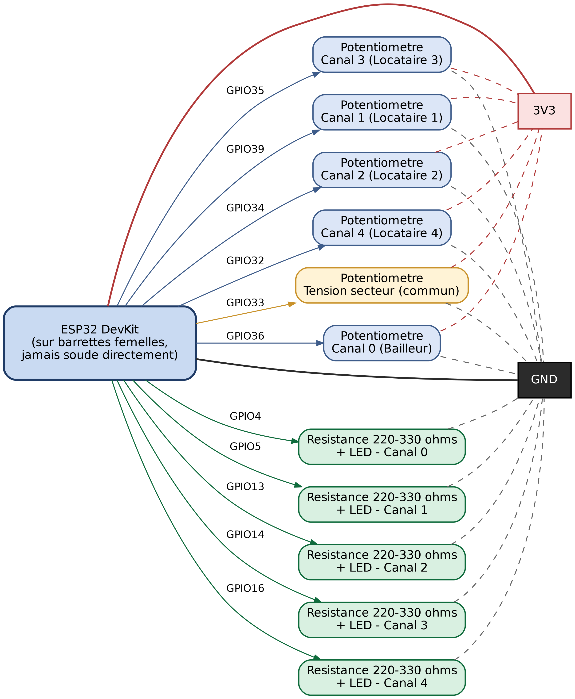

# Guide — Câblage et boîtier de la maquette (sur carte perforée)

Objectif : assembler la maquette (ESP32 + 6 potentiomètres + 5 LED) en
soudant sur une carte perforée à trous isolés (perfboard), puis la loger
dans un boîtier en bois — solide et présentable pour la soutenance.

**Carte perforée à trous isolés** : contrairement à une carte à bandes
(stripboard/veroboard), chaque trou est indépendant — aucune connexion
n'existe entre les trous au départ. Tout ce qui doit être relié (les bus
3V3 et GND en particulier) doit être ponté toi-même, avec un fil ou une
goutte de soudure entre pastilles voisines. C'est plus de travail qu'une
carte à bandes, mais plus flexible : aucun risque de connexion parasite
entre deux pastilles qui ne devraient pas être reliées.

## 1. Liste des composants (devis)

| Composant | Quantité | Valeur / précision |
|---|---|---|
| Carte perforée (perfboard) | 1 | trous isolés, pas 2,54 mm, assez grande pour les 2 barrettes ESP32 + bus 3V3/GND |
| Potentiomètres | 6 | 10 kΩ, linéaire (5 courant + 1 tension commune) |
| Résistances | 5 | 220 à 330 Ω, ¼ W (une par LED) |
| LED | 5 | 5 mm (ou 3 mm selon disponibilité) |
| Barrette(s) femelle | 2 x 19 broches | pas 2,54 mm — pour enficher l'ESP32 sans le souder |
| Fil de câblage | selon besoin | souple/multibrin, fin (~AWG24-26) |
| Gaine thermo ou scotch électrique | selon besoin | isoler chaque soudure |
| Colle chaude | un peu | strain relief + fixation dans le boîtier |

Alimentation : **3,3V via le port USB de l'ESP32** (régulateur embarqué sur
la carte) — pas d'alimentation externe nécessaire, la consommation totale
(≈30-35 mA) est très en dessous de ce que le régulateur peut fournir.

## 2. Monter l'ESP32 sans le souder

Coupe ta barrette femelle en deux morceaux de 19 broches (l'ESP32 DevKit a
deux rangées séparées par l'espace occupé par la puce/le port USB — une
seule barrette continue de 38 ne peut pas être utilisée telle quelle).

Positionne les deux morceaux sur la carte perforée, à l'écartement exact
des deux rangées de pattes de l'ESP32 (vérifie avec l'ESP32 lui-même
avant de souder quoi que ce soit). **Soude chaque broche des barrettes
dans son trou**, côté cuivre — c'est ce qui ancre les barrettes à la
carte. Une fois les barrettes fixées et le câblage terminé, enfiche
l'ESP32 dedans : il n'est jamais soudé directement, tu peux le retirer
pour le reprogrammer ou le remplacer sans tout dessouder.

Vérifie l'écartement des deux barrettes par rapport à la grille de la
carte perforée : selon le pas de ta carte (normalement 2,54 mm comme les
barrettes), les deux rangées de trous où elles doivent aller ne
correspondent pas toujours pile à l'écartement réel de l'ESP32. Pose
l'ESP32 à plat sur la carte avant de souder pour repérer où percer/souder
exactement.

## 3. Schéma de câblage

| Canal | Potentiomètre → broche | LED (avec résistance) → broche |
|---|---|---|
| 0 (bailleur) | GPIO36 | GPIO4 |
| 1 (locataire 1) | GPIO39 | GPIO5 |
| 2 (locataire 2) | GPIO34 | GPIO13 |
| 3 (locataire 3) | GPIO35 | GPIO14 |
| 4 (locataire 4) | GPIO32 | GPIO16 |
| Tension secteur (commun, 1 seul potentiomètre) | **GPIO33** | — |

**Important** : le potentiomètre de tension doit être sur GPIO33 (ADC1), pas
GPIO25 — GPIO25 est sur l'ADC2, inutilisable en continu dès que le point
d'accès Wi-Fi de la maquette est actif, ce qui bloque la lecture de tension
(et donc puissance/énergie/crédit, qui en dépendent).

- Potentiomètre : pattes extérieures sur **3V3** et **GND**, curseur (broche
  du milieu) sur la broche GPIO indiquée
- LED : anode (patte longue) vers la broche GPIO **à travers la résistance
  220-330Ω**, cathode (patte courte, méplat sur le boîtier) vers **GND**

## 4. Méthode de soudure sur carte perforée

- **Un canal à la fois** : câble et teste le canal 0 en entier avant de
  passer au canal 1. Plus facile de repérer une erreur sur un seul canal
  que sur cinq à la fois.
- **Construis d'abord les bus 3V3 et GND** : choisis une ligne de trous
  le long d'un bord de la carte pour le 3V3, une autre pour le GND.
  Comme les trous sont isolés, relie-les entre eux toi-même — soit avec
  un bout de fil rigide (une chute de patte de résistance dénudée fait
  très bien l'affaire) soudé d'un trou à l'autre en ligne, soit avec une
  goutte de soudure entre deux pastilles voisines si elles se touchent
  presque. Vérifie au multimètre (mode continuité) que toute la ligne est
  bien reliée d'un bout à l'autre avant de brancher quoi que ce soit
  dessus.
- **Une fois les bus faits**, chaque composant (potentiomètre, LED,
  résistance, broche ESP32) se raccorde par un fil court vers le bus
  concerné, ou directement de trou à trou pour les connexions signal
  (curseur de potentiomètre → GPIO, etc.).
- **Isole quand même chaque soudure** côté cuivre (gaine thermo ou
  vernis/scotch électrique) — une carte perforée réduit le risque de
  court-circuit accidentel par rapport au point-à-point dans le vide,
  mais des rognures de fil qui traînent entre deux pastilles voisines
  restent possibles.
- **Un peu de mou sur chaque fil** qui sort vers les potentiomètres/LED
  du panneau (ne tire pas les fils bien droits) et un point de colle
  chaude à la base de chaque soudure pour la protéger si le fil bouge.
- **Étiquette chaque fil** (scotch + numéro de canal) au fur et à mesure,
  pas à la fin.

## 5. Le boîtier en bois

**Dimensions** : prévois large — la contrainte principale est la hauteur de
l'ESP32 monté sur ses barrettes (~2,5 cm) et l'accès USB. Une boîte
15x10x5cm est confortable.

**Panneau avant** (celui que le jury regarde) :
- 5 trous pour les axes de potentiomètre (Ø ~7mm selon le modèle)
- 5 trous pour les LED (Ø ~5mm, ou 3mm selon la taille de tes LED)
- **Étiquette au-dessus de chaque paire** : « Bailleur », « Locataire 1 »,
  « Locataire 2 », « Locataire 3 », « Locataire 4 » — au feutre fin, à la
  pyrogravure si tu as l'outil, ou étiquette imprimée collée

**Panneau arrière ou latéral** :
- Une découpe pour le port USB de l'ESP32 (accès direct au câble sans
  ouvrir la boîte)

**Fixation interne** :
- Fixe le montage soudé avec des points de colle chaude aux coins/points
  d'ancrage (assez solide pour une maquette, facile à décoller si besoin
  de réparer)
- Ne colle/visse les potentiomètres et LED sur le panneau qu'**après**
  avoir vérifié que tout fonctionne

## 6. Ordre de travail recommandé

1. Coupe et prépare les barrettes femelles (2 x 19 broches), soude-les
   sur la carte perforée, puis construis les bus 3V3 et GND (teste au
   multimètre avant de continuer)
2. Câble un canal complet, teste-le (flash déjà fait sur l'ESP32)
3. Répète pour les canaux 1 à 4, puis le potentiomètre de tension
4. Perce le panneau avant du boîtier (mesure deux fois, perce une fois)
5. Monte potentiomètres et LED sur le panneau, relie-les avec des fils
   assez longs pour pouvoir sortir le panneau si besoin
6. Reteste tout **avant** de refermer définitivement la boîte
7. Ajoute les étiquettes
8. Referme, fais un dernier test complet (flash + Wi-Fi + appli) une fois
   la boîte assemblée

---

Si tu bloques sur une étape demande-moi avant de souder ou de percer — plus
facile de corriger un plan qu'une soudure déjà faite ou un trou dans le bois.
